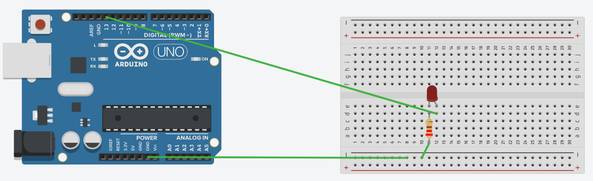

# Projeto pisca pisca

## Material necessário
- 1 arduino uno
- 1 resistor de 220 ohms ou 330 ohms
- 1 led
- 1 protoboard
- cabos de ligação

## Realizar a montagem conforme imagem abaixo

## Objetivo
Controlar o funcionamento do led com nível alto (1) e baixo (0).