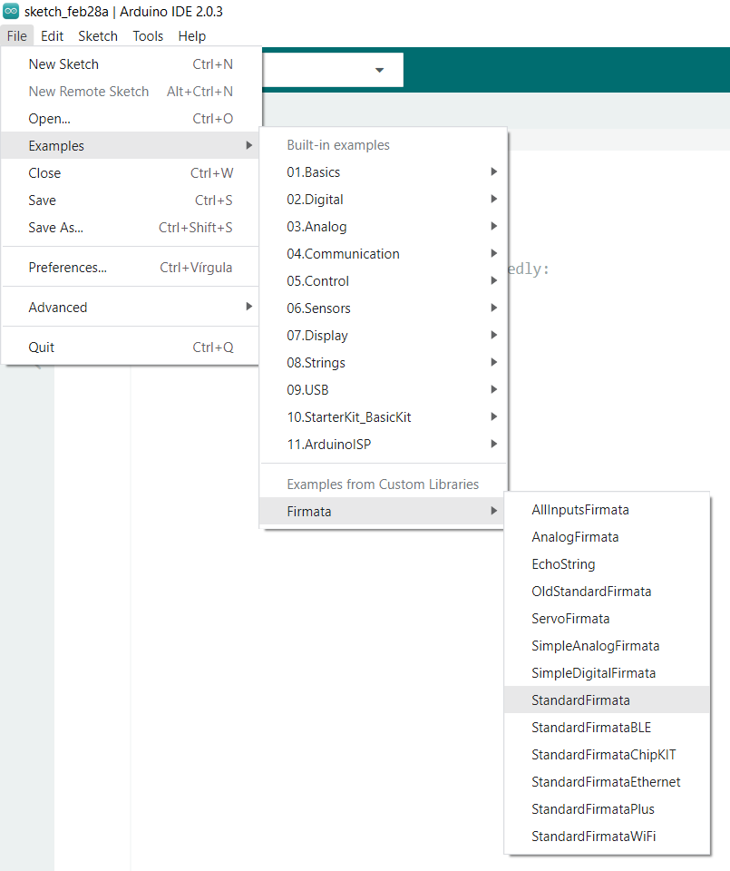

# Instruções para executar códigos

## Integração entre python e arduino
Realizar o processo de gravação do protocolo de comunicação Firmata, ele 
possibilitará que programas em python se comuniquem com arduino, detalhes na imagem abaixo.

## Instação da biblioteca pyfirmata
Realizar a instação da biblioteca python pyfirmata conforme link abaixo.
PyFirmata https://pypi.org/project/pyFirmata/