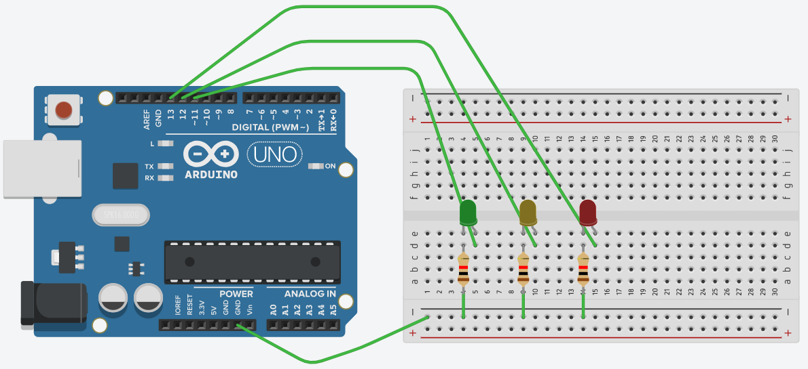

# Projeto sinal trânsito

## Material necessário
- 1 arduino uno
- 3 resistores de 220 ohms ou 330 ohms
- 1 led vermelho
- 1 led amarelo
- 1 led verde
- 1 protoboard
- cabos de ligação

## Realizar a montagem conforme imagem abaixo

## Objetivo
Controlar o funcionamento dos leds com nível alto (1) e baixo (0).
Simulação do sinal de trânsito.